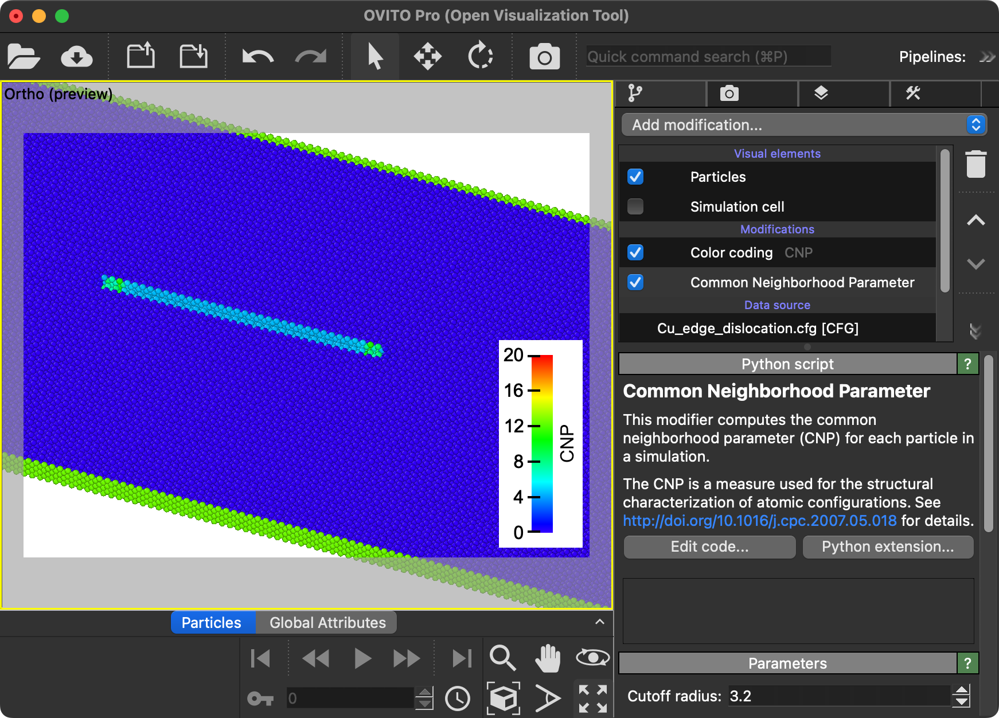

# Common Neighborhood Parameter

An [OVITO modifier](https://docs.ovito.org/reference/pipelines/modifiers/python_script.html) for computing the common neighborhood parameter (CNP)

## Description

The CNP is a scalar measure used for the structural characterization of atomistic simulations.
See the following publication for details:

  Helio Tsuzuki, Paulo S. Branicio, José P. Rino,
  Structural characterization of deformed crystals by analysis of common atomic neighborhood,
  Computer Physics Communications,
  Volume 177, Issue 6, 2007,
  Pages 518-523,
  https://doi.org/10.1016/j.cpc.2007.05.018

## Parameters 

| GUI name                        | Python name       | Description                                                      | Default Value |
|---------------------------------|-------------------|------------------------------------------------------------------|---------------|
| **Cutoff radius**               | `cutoff`          | Nearest neighbor cutoff distance in simulation units of length   | `3.2`         |


## Example



## Installation

- OVITO Pro [integrated Python interpreter](https://docs.ovito.org/python/introduction/installation.html#ovito-pro-integrated-interpreter):
  ```
  ovitos -m pip install --user git+https://github.com/ovito-org/CommonNeighborhoodParameter.git
  ``` 
  The `--user` option is recommended and [installs the package in the user's site directory](https://pip.pypa.io/en/stable/user_guide/#user-installs).

- Other Python interpreters or Conda environments:
  ```
  pip install git+https://github.com/ovito-org/CommonNeighborhoodParameter.git
  ```

## Technical information / dependencies
- Tested on OVITO version 3.12.0

## Contact
Paulo Branicio branicio@usc.edu
OVITO Support Team support@ovito.org